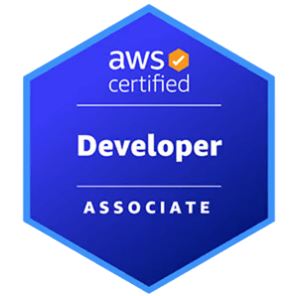

# 👋 ¡Hola, soy Mario Jiménez Marset!

## 💻 Sobre mí
Desarrollador web apasionado por crear aplicaciones con tecnologías modernas. Me encanta tanto el frontend como el backend, aunque tengo una debilidad especial por este último. 

Disfruto explorando nuevas herramientas y lenguajes mientras colaboro en proyectos interesantes. La constancia, resiliencia y el aprendizaje continuo son mis motores diarios.

¡Siempre en busca del próximo desafío tecnológico! 🚀

---

## 🛠️ Mi Stack Tecnológico

### 🎨 Frontend

### ⚙️ Backend

### ☁️ Cloud

### 🗄️ Bases de Datos

### 🧰 Herramientas

---

## 🌱 Actualmente estoy...
- 💼 Realizando proyectos personales y trabajando como desarrollador web full stack.
---

## 🏆 Certificaciones

  <h3>Microsoft</h3>
  

    

      <a href="https://learn.microsoft.com/es-es/users/mariojimenezmarset-5547/credentials/49fe011e61bf1ec8?ref=https%3A%2F%2Fwww.linkedin.com%2F">
        
        
Power Platform Fundamentals

      </a>
    

    

      <a href="https://learn.microsoft.com/api/credentials/share/es-es/MarioJimenezMarset-5547/C0A404BD8891E1B1?sharingId=1C9169A92F4DA389">
        
        
Azure Developer Associate

      </a>
    

    

      <a href="https://learn.microsoft.com/api/credentials/share/es-es/MarioJimenezMarset-5547/9F6B4692A8B7C08A?sharingId=1C9169A92F4DA389">
        
        
Azure AI Engineer Associate

      </a>
    

  

  <h3>AWS</h3>
  

    <a href="https://www.credly.com/badges/07057379-d3cc-44a1-abf4-7055b8eb8a54">
      
      
AWS Developer Associate

    </a>
  

---

## 📫 ¿Hablamos?
- ✉️ [mariojimenezmarset@outlook.com](mailto:mariojimenezmarset@outlook.com)
- 🔗 [LinkedIn](https://www.linkedin.com/in/mario-jiménez-marset-51489825a)

> "El código limpio hace una cosa y la hace bien" - Robert C. Martin
